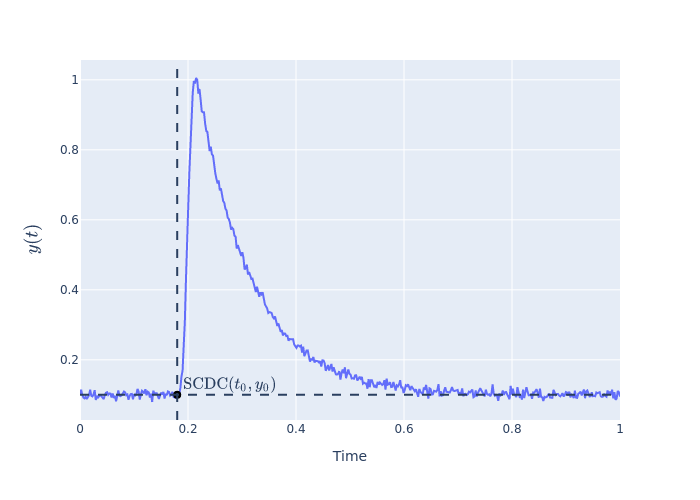

# Deep Learning Solution to the SCDC Problem <!-- omit in toc -->

This repogitory provides a deep learning solution to [the SCDC problem](#Problem).

1. A sequential neural network was traind with a dataset of decay curves.
2. The dataset was created by solving an ordinary differential equation.
3. `keras-tuner` was used to tune the hyperparameters of the neural network.

- [Problem](#problem)
- [Usage](#usage)
  - [Load a dataset](#load-a-dataset)
  - [Use a model](#use-a-model)
  - [Run in local](#run-in-local)
- [License](#license)

## Problem

We have measured a bunch of decay curves such as those of a carrier relaxation process,
and we have discovered most of them are well fitted with a two-componential exponential function as followed:

$$y(t) = A_1 \exp{(-t/\tau_1)} + A_2 \exp{(-t/\tau_2)}$$
where $y(t)$ is an output as a function of time like a PL intensity, $A_1$ and $A_2$ are weighting coefficients, and $\tau_1$ and $\tau_2$ are decay times.

Before fitting the function to a curve, we have to find the start coordinates of a decay curve(SCDC) in order to get an accurate decay time.
The calculated decay time, however, depended heavily on who analyzed the data or who created a function that returns SCDC, because we didn't have an established way to determine SCDC.



Now, we are trying to solve this problem with a deep learning algorithm.

## Usage

### Load a dataset

Load a dataset as a pandas.DataFrame object.

```python
import pandas as pd
repo = f"https://github.com/wasedatakeuchilab/DL-SCDC"
dataset_name = "dataset"
version = "0.0.0"
df = pd.read_csv(f"{repo}/raw/{dataset_name}/v{version}/datasets/{dataset_name}.csv.gz")
dataset = list(df.groupby("id"))
```

### Use a model

Predict the SCDC using the trained model of a neural network.

```python
import tensorflow as tf
import numpy as np
model_name = "tuning"
version = "0.0.0"
model = tf.keras.models.load_model(
    tf.keras.utils.get_file(
        f"{model_name}_v{version}",
        f"{repo}/raw/{model_name}/v{version}/models/{model_name}.tar.gz",
        archive_format="tar",
        untar=True
    )
)
_, df = dataset[0]
prediction, *_ = model.predict(np.expand_dims(df.y, 0))
```

### Run in local

Python 3.10 or above is required.

Clone the repo and install requirements.

```sh
$ git clone https://github.com/wasedatakeuchilab/DL-SCDC
$ cd DL-SCDC
# It is recommended to create a new virtual environment using something like venv
$ pip install -r requirements.txt
```

## License

[MIT License](./LICENSE)

Copyright (c) 2022 Shuhei Nitta
